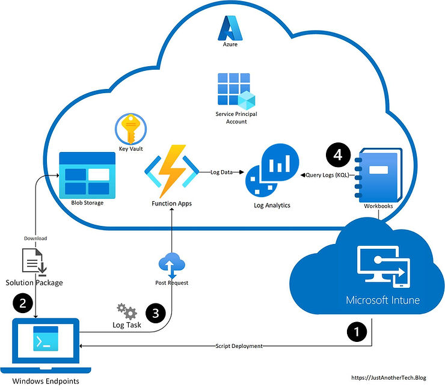
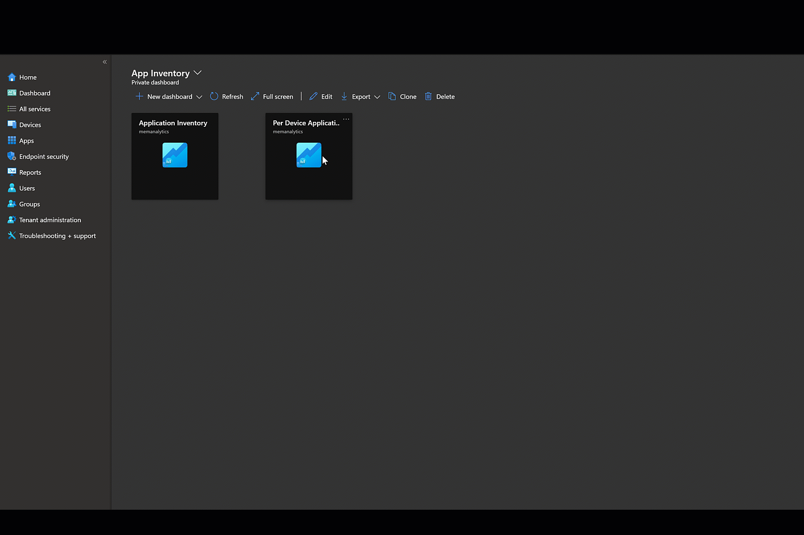

# Custom Reporting on Windows Devices via Microsoft Intune

**Published:** December 30, 2021
**Updated:** October 5, 2023
**Author:** Jack D.

## Challenge

Microsoft Intune administrators often require reporting capabilities above those offered out-of-box. For those coming from Endpoint Configuration Manager, extending hardware inventory was made possible via MOF configuration changes. Additionally, with a decent understanding of SQL and Report Builder, ConfigMgr professionals can build their own custom reports to meet their specific enterprise need.

As for custom logging and reporting in Intune, many Endpoint Manager professionals are unclear where to start. In this post, I will explore a PowerShell-driven (with a little KQL) solution which I have developed to extend your logging capabilities against Windows endpoints while enabling the custom reporting that your organization desires.

## Solution Concepts

**Definition Files** – PowerShell scripts (.ps1) identifying client data to inventory and Log Analytics storage table

**Initialization Script** – PowerShell script (.ps1) to configure custom logging tasks on Windows endpoints

**Log Task** – Scheduled Task (.ps1) responsible for recurring inventorying of the defined log definitions

**Check-in** – Recurring Scheduled Task action by client endpoints to upload latest results of defined log definitions

**Solution Package** - Compressed (.zip) package containing Log Task & Definition Files to be delivered to individual endpoints

## Solution Summary

In short, the described process works by triggering a scheduled task on Windows endpoints to retrieve data defined in the definition files. Then, clients communicate with a web service for data hand-off to the appropriate log tables. Once ingested, an Endpoint Manager professional (or data specialist with proper RBAC) can customize the presentation of the data ingested for reporting purposes.



This solution leverages several Azure-based technologies for handling data, securing credentials and communicating with client endpoints. Much of the added complexity is to enhance security. Before proceeding, ensure your organization has the necessary licensing and proper RBAC for full integration. See the 'Prerequisites & Recommendations' section for included technologies. Solution files can be found on my [GitHub](https://github.com/JackDDavis/EnhancedLogging). Please see the various Microsoft Docs referenced throughout if there are questions about setup of individual Azure services.

**Please Note:** I am not a licensing specialist and will not discuss licensing throughout this post.

## Prerequisites & Recommendations

Along with the necessary prerequisites, I've included several recommendations to make for a more secure & complete solution.

### Microsoft Intune - Solution Deployment & Configuration

- Distribute certificate to client endpoints: PFX certificate will be used to securely authenticate to various Azure services via PowerShell (*Security recommendation*)
- [Enable Intune diagnostics](https://docs.microsoft.com/en-us/mem/intune/fundamentals/intune-diagnostics) reporting from Tenant Administration: The workspace used with Intune diagnostics reporting can also be used for custom logging by solution (*Logging requirement*)
- Assign appropriate RBAC for accessing Azure Monitor Workbooks (*Reporting requirement*)
- Assign appropriate RBAC for profile/script deployment by administrators (*Configuration requirement*)

### Azure Functions (Web App Service) – Client Endpoint request handling

- [Create a new Azure Function](https://docs.microsoft.com/en-us/azure/azure-functions/functions-create-first-azure-function) app with PowerShell Core as its Runtime stack (*Logging requirement*)
- Enable TLS for [HTTPS ONLY](https://docs.microsoft.com/en-us/azure/app-service/configure-ssl-bindings) traffic (*Security recommendation*)
- Upload a trusted certificate to authenticate requests to the web service (*Security recommendation*)

### Log Analytics - Logging Output

- If workspace not already shared with Intune Diagnostics, [create new Log Analytics workspace](https://docs.microsoft.com/en-us/azure/azure-monitor/logs/quick-create-workspace) (*Logging requirement*)
- Assign appropriate RBAC to data professional(s) for creation of Azure Monitor Workbooks (*Reporting requirement*)

### Service Principal Account - Identity used in accessing Azure resources

- Create Azure AD application registration to use as [Service Principal (SP) account](https://docs.microsoft.com/en-us/azure/active-directory/develop/howto-create-service-principal-portal) (*Security Recommendation*)
- Grant [Access Control](https://docs.microsoft.com/en-us/azure/role-based-access-control/role-assignments-portal) (IAM)

### Azure Storage - Solution Package storage location

- Create container for use with Solution Package blob (*Configuration requirement*)
- Optionally, create a separate container to be used for automatic upload of failure logs (*Configuration recommendation*)
- Grant access to Service Principal Account via [Access Control](https://docs.microsoft.com/en-us/azure/role-based-access-control/role-assignments-portal) (IAM)

### Azure KeyVault - Secret Management

- Grant access to Service Principal via [Access Control](https://docs.microsoft.com/en-us/azure/role-based-access-control/role-assignments-portal) (IAM)

### PowerShell - Solution Package Language

- Retrieve **Azure Monitor upload script** (`Upload-AzMonitorLog`) from PowerShell Gallery (*Logging requirement*): https://www.powershellgallery.com/packages/Upload-AzMonitorLog/
- Package **Azure Monitor upload script** as [PowerShell script module](https://docs.microsoft.com/en-us/azure/azure-functions/functions-reference-powershell#dependency-management) for later use with Azure Function App (*Web App Service requirement*)

## Implementation

Now that we've gotten that out of the way, Let's jump into it!

### Service Principal Account

To securely authenticate to Azure resources during initialization & check-in, we create a Service Principal account with the proper permissions. This will leverage our trusted certificate pushed to Windows endpoints. Within the AAD App Registration, [upload certificate](https://docs.microsoft.com/en-us/azure/active-directory/develop/howto-create-service-principal-portal#upload-a-certificate) under **Manage** > **Certificates & Secrets**.

### Azure Storage

We'll [upload the Solution Package to blob storage](https://docs.microsoft.com/en-us/azure/storage/blobs/storage-quickstart-blobs-portal). You will need to update [Log Task script](https://github.com/JackDDavis/EnhancedLogging/blob/main/Log-Task.ps1) file prior to uploading. Be sure to [generate SAS token](https://docs.microsoft.com/en-us/azure/storage/common/storage-sas-overview). Define token expiration and provide READ permissions to blob. Copy this SAS token for later use.

### Azure Key Vault

[Generate a new secret](https://docs.microsoft.com/en-us/azure/key-vault/secrets/quick-create-portal) in Key Vault and paste Azure Blob Storage SAS token as its value. This secret is to be called in our [Initialization script](https://github.com/JackDDavis/EnhancedLogging/blob/main/WinLogging.ps1). Copy name of secret to use in `$kvSecret` variable.

See **Appendix** for details on the defined variables

### Azure Function

Now this is where the action happens! Create a new function in your Azure Function App with an HTTP trigger type.

1. Under 'Development Tools', navigate to App Service Editor
2. [Add dependencies](https://docs.microsoft.com/en-us/azure/azure-functions/functions-reference-powershell#dependency-management) to Azure Function app via the '`Requirements.psd1`' file to leverage Azure modules. For our purposes, we'll specifically need "Az.OperationalInsights" as shown below.

   

3. [Upload](https://docs.microsoft.com/en-us/azure/azure-functions/functions-reference-powershell#dependency-management) the Azure Monitor module you created as a custom module.

4. Grant necessary permissions to Log Analytics (IAM)

   

5. Navigate to **Function App > [Function Name]** > **Developer** > **Code + Test**.

6. Update Azure Function app Body to begin accepting requests from endpoints ([GitHub](https://github.com/JackDDavis/EnhancedLogging/blob/main/FunctionApp.ps1)). Do not remove namespace or bindings.

```powershell
$ltn = $Request.Query.Name
if (-not $ltn) {
    $ltn = $Request.Body.uploadGroup | Select-Object -First 1
}

$body = "Logs not uploaded"

#########################

if ($ltn) {
    $body = "HTTP triggered function executed successfully. Logging $ltn."
    $log2Upload = $Request.Body
    # Get Log Analytics Workspace Key
    Write-Verbose "Creating Log Analytics Workspace Key" -Verbose
    $workspace = Get-AzOperationalInsightsWorkspace | Where-Object { $_.Name -like $wkspc }
    $cxId = $workspace.CustomerId
    $wsKey = Get-AzOperationalInsightsWorkspaceSharedKeys -ResourceGroupName $azRG -Name $workspace.Name

    if ($log2Upload) {
        $log2Upload | Upload-AzMonitorLog -WorkspaceId ($cxId).Guid -WorkspaceKey $wsKey.PrimarySharedKey -LogTypeName $ltn -Verbose
    }
}
```

### Initialization Script

There are three parts to the [initialization script](https://github.com/JackDDavis/EnhancedLogging/blob/main/WinLogging.ps1) – module installation, solution retrieval, and scheduled task creation. First, we install the necessary PowerShell modules needed on clients. For our solution, we'll need 3 components from Az modules. These include Resources, Storage, and KeyVault.

```powershell
$requiredModules = "Az.Accounts", "Az.Storage", "Az.Keyvault"

$installedModules = Get-InstalledModule
ForEach ($moduleName in $requiredModules) {
    If ($moduleName -notin $installedModules.Name ) {
        Write-Verbose "Installing module $moduleName" -Verbose
        Install-Module $moduleName -Force -SkipPublisherCheck -Repository 'PSGallery'
    }
}

# Import required modules
Write-Verbose "Loading required modules"
foreach ($module in $requiredModules) {
    Import-Module -Name $module
}
```

**Az.Resources** module is needed for authentication to Azure services.

```powershell
Write-Verbose "Connecting to Azure"
$connectArgs = @{
    TenantId = $tid
    Subscription = $azSubscription
    CertificateThumbprint = $cThumbprint
    ApplicationId = $aadAppId
}
Connect-AzAccount @connectArgs -ServicePrincipal -Verbose -ErrorAction Stop
```

**Az.Keyvault** is required for retrieving secrets. During initialization, we use this to retrieve the SAS token from our Azure Blob.

```powershell
$kvSecret = Get-AzKeyVaultSecret -VaultName $kv -Name $kvSecretName -AsPlainText
```

Next, **Az.Storage** is used for downloading the [Solution Package](https://github.com/JackDDavis/EnhancedLogging/blob/main/Solution-Package.zip) from Azure blob storage. Once this is complete, the content is extracted from zip.

```powershell
if (-not(test-path -Path "$PSScriptRoot\$azBlob")) {
    Write-Verbose "Blob not loaded. Download and extracting content" -Verbose
    $ctx = New-AzStorageContext -StorageAccountName $azStorage -SasToken $kvSecret -Verbose
    Get-AzStorageBlobContent -Container $azContainer -Blob $azBlob -Context $ctx -Destination $PSScriptRoot -Verbose
    if (-not(test-path -Path "$PSScriptRoot\$schTsk")) {
        Expand-Archive -Path "$files\$azBlob" -DestinationPath $files -Verbose
    }
}
```

Lastly as part of the [initialization](https://github.com/JackDDavis/EnhancedLogging/blob/main/WinLogging.ps1), we create the scheduled task (**Log Task**).

```powershell
$actions = New-ScheduledTaskAction -Execute "$env:SystemRoot\System32\WindowsPowerShell\v1.0\powershell.exe" -Argument "$schTskLocation\$fileName\$schTsk"
$trigger = New-ScheduledTaskTrigger -Daily -At $curTime
$principal = New-ScheduledTaskPrincipal -UserId "NT AUTHORITY\SYSTEM" -RunLevel Highest
$settings = New-ScheduledTaskSettingsSet -RunOnlyIfNetworkAvailable -AllowStartIfOnBatteries -DontStopIfGoingOnBatteries -RestartCount 3
$task = New-ScheduledTask -Action $actions -Principal $principal -Trigger $trigger -Settings $settings
Write-Verbose "Schedule Task '$fileName' is being registered" -Verbose
Register-ScheduledTask $fileName -InputObject $task
```

See [variables.md](https://github.com/JackDDavis/EnhancedLogging/blob/main/variables.md) on GitHub for additional detail on variables used throughout solution.

### Definition Files

We then create our definition files. These can be anything you can retrieve from the device. For starters, I have defined two log definitions that are consistently top-of-mind for enterprise administrators I speak with; Applications & Updates. Today, Intune administrators can report on Application Inventory in-console. And the [Update Compliance](https://docs.microsoft.com/en-us/windows/deployment/update/update-compliance-monitor) Log Analytics solution can go much further in reporting on cloud-managed Updates (Windows Updates for Business). But for some organizations, it just doesn't cover everything you require. These script files reside in our scheduled task's source directory and begin with "`DEF-`".

**To build a definition file:**

1. Define the Log Analytics table. This is the table in which you'll query via Kusto once the data has been uploaded. This is represented as `$uploadlag` (Upload Log Analytics Group) in each script.

```powershell
$uploadlag = 'WinAppInv'
```

2. Perfect your PowerShell query. Filter down to only the properties you'd like in logging

3. Specify the object properties that will represent table entries in your logs. For example, if you want to capture Application Name, Publisher, & Version, change the PSCustomObject properties to represent those captured by your query.

```powershell
[pscustomobject]@{
    DeviceId       = $deviceId
    DeviceName     = $deviceName
    Application    = $_.DisplayName
    Publisher      = $_.Publisher
    Version        = $_.Version
    InstallDate    = $_.InstallDate
    CollectionTime = [System.DateTime]::UtcNow
    uploadGroup    = $uploadlag
}
```

**NOTE:** Do not modify: `DeviceId`, `DeviceName`, `CollectionTime`, `UploadGroup`

4. Go wild! Create as many log definitions desired. Once completed (including Log Task changes below), zip all definition files along with the Log Task into a shared Solution Package. `WinAppInv` definition file referenced above can be found on [GitHub](https://github.com/JackDDavis/EnhancedLogging).

### Log Task

The [Log Task](https://github.com/JackDDavis/EnhancedLogging/blob/main/Log-Task.ps1) will start similarly to the initialization script, connecting to Azure using our Service Principal account. We then inventory existing definition files.

```powershell
$uploadScripts = Get-ChildItem -Path $PSScriptRoot | Where-Object {$_.Name -like "Def-*"}
foreach ($script in $uploadScripts) {
    . .\$script
}
```

Upon retrieval, we convert each definition file to JSON & push them to our Azure Function.

```powershell
$uri = Get-AzKeyVaultSecret -VaultName $kv -Name $tskSecret -AsPlainText
foreach ($log in $allLogs) {
    $log2Upload = $laUpload.$log
    $body = $log2Upload | ConvertTo-Json
    Invoke-WebRequest -Uri $uri -Method Post -Body $body -ContentType application/json -UseBasicParsing
}
```

### Deploying solution with Microsoft Intune

[Create & assign](https://docs.microsoft.com/en-us/mem/intune/apps/intune-management-extension) a new PowerShell script policy. Under Script settings, leave 'Run this script using the logged on credentials' set to default to ensure this runs as System. Then, upload the Initialization script ([WinLogging.ps1](https://github.com/JackDDavis/EnhancedLogging/blob/main/WinLogging.ps1)). Lastly, set appropriate Scope as defined by your organization and target devices.

### Log Analytics

Once deployment has succeeded, you will begin noticing logs appear in your Log Analytics workspace. All custom logs are appended with 'CL' (`<definitionFileName>_CL`).


To wrap up, I will walk you through creating two Application Inventory reports from the included Definition file.

1. In the Endpoint Manager Admin Center, navigate to the Reports blade. (Note: Workbooks can also be created directly from Log Analytics workspace)

2. Under "Azure Monitor", select 'Workbooks'

3. Create new Workbook. Begin by removing existing code and adding the below KQL.

```kusto
WinAppInv_CL
| where  isnotempty(Application_s)
| distinct Application_s, Publisher_s
| sort by Application_s asc
```

4. Next, add a parameter for DeviceID. Define properties as shown below

   

5. Add a 2nd query to the notebook just under the parameter. Create

```kusto
WinAppInv_CL
|   where DeviceId_g contains {DeviceId:value}
|   where isnotempty(DeviceId_g)
|   distinct Application_s, Publisher_s, Version_s, InstallDate_s
```

6. You're finished! Define a report name & auto refresh interval. Save your report and that's it. Optionally, pin to Dashboard for quicker access to your new report.

   

---

Retrieve full solution files from my GitHub repository. Contribute via the Community Branch: https://github.com/JackDDavis/EnhancedLogging

## Resources

- [GitHub Repository](https://github.com/JackDDavis/EnhancedLogging)
- [Upload-AzMonitorLog PowerShell Module](https://www.powershellgallery.com/packages/Upload-AzMonitorLog/)
- [Microsoft Intune Documentation](https://docs.microsoft.com/en-us/mem/intune/)
- [Azure Functions Documentation](https://docs.microsoft.com/en-us/azure/azure-functions/)
- [Log Analytics Documentation](https://docs.microsoft.com/en-us/azure/azure-monitor/logs/)
